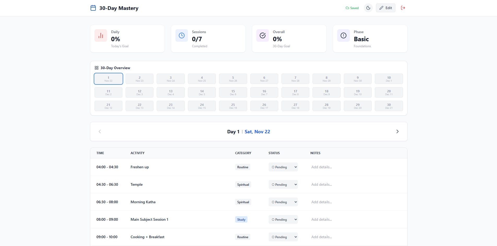
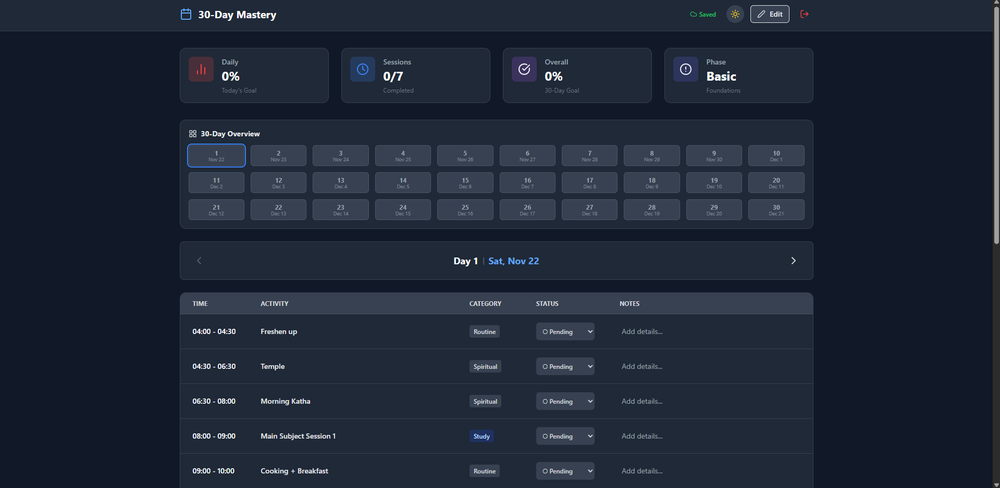

📅 GhanuRoutine - 30-Day Mastery Tracker

GhanuRoutine is a modern, responsive web application designed to help users master their daily habits over a 30-day period. It features personalized tracking, cloud synchronization, and smart calendar management.

🚀 Live Demo: https://ghanuroutine.web.app/

✨ Key Features

🔐 Multi-Method Authentication: Secure login via Google, Email/Password, and Phone Number (OTP).

☁️ Cloud Sync: All data is stored securely in Firebase Firestore, ensuring your progress is saved across devices.

🌓 Dark Mode: Fully adaptive UI with a built-in dark mode toggle for late-night planning.

📅 Smart Calendar: Automatically calculates "Day 1" based on your personalized start date. If you miss a day, the calendar keeps moving, motivating you to stay on track.

📊 Progress Dashboard: Visual progress bars and statistics (Daily completion %, Total completion, Phase tracking).

📂 Data Export: Download your entire 30-day report as a CSV file for backup or analysis.

📱 Fully Responsive: Works perfectly on Desktops, Tablets, and Mobile devices.

🛠️ Tech Stack

Frontend Framework: React (via Vite)

Styling: Tailwind CSS

Icons: Lucide React

Backend/Database: Firebase Firestore

Authentication: Firebase Auth

Hosting: Firebase Hosting

🚀 Getting Started (Local Development)

Follow these steps to run the project on your local machine.

Prerequisites

Node.js (v16 or higher) installed.

A Google/Firebase account.

1. Clone the Repository

git clone [https://github.com/yourusername/ghanu-routine.git](https://github.com/yourusername/ghanu-routine.git)
cd ghanu-routine

2. Install Dependencies

npm install

3. Configure Firebase

Go to the Firebase Console.

Create a new project.

Enable Authentication:

Go to Build > Authentication > Sign-in method.

Enable Google, Email/Password, and Phone.

Enable Firestore:

Go to Build > Firestore Database.

Create database (Start in Test Mode for development).

Get Config:

Go to Project Settings > General.

Register a web app (</>) and copy the firebaseConfig object.

Update Code:

Open src/App.jsx.

Replace the const firebaseConfig = { ... } object with your own keys.

4. Run the App

npm run dev

The app will start at http://localhost:5173.

📦 Deployment

This project is optimized for Firebase Hosting.

Install Firebase CLI:

npm install -g firebase-tools

Login to Firebase:

firebase login

Initialize Hosting:

firebase init hosting

Public directory: dist

Configure as single-page app: Yes

Github Actions: No

Build and Deploy:

npm run build
firebase deploy

📸 Screenshots

Light Mode

Dark Mode

📄 License

This project is open-source and available under the MIT License.

Made with ❤️ for self-improvement.